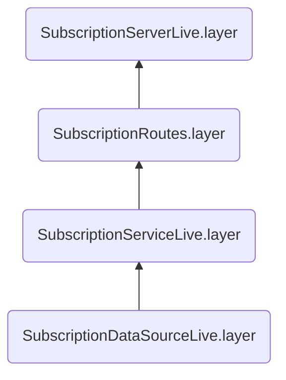

# Documentation in a nutshell:

# How to run:
First, you need to run the following command where you have build.sbt:

    sbt clean compile

### Structure

### Important notes:

* Decided to keep everything simple, since Technical test was simple.
* Could not explore TataSky, and I did not have a good example but tried to check similar websites.
* API server is added as an example since it wasn't mention in the Email.